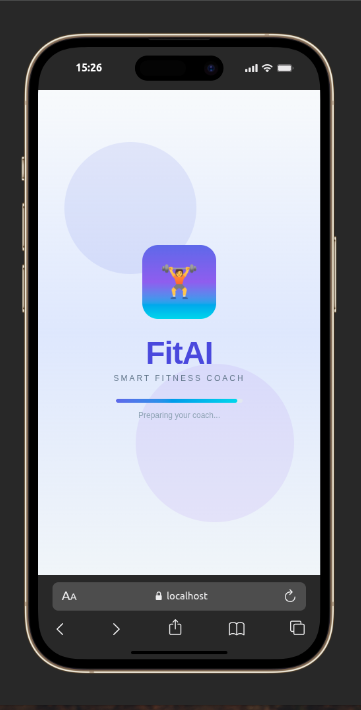
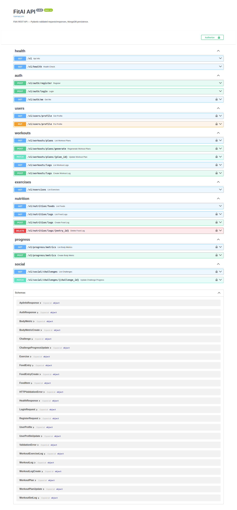

<div align="center">

# 💪 FitAI

**Your AI-powered fitness companion — train smarter, eat better, track progress, and stay motivated.**

[](https://expo.dev)
[](https://reactnative.dev)
[](https://fastapi.tiangolo.com)
[](https://www.mongodb.com)

*Cross-platform mobile app (iOS · Android · Web) with a production-style REST API backend*

</div>

---

## 🎬 Preview

<div align="center">

### 📱 App Walkthrough

<a href="https://photos.app.goo.gl/zeQWyXuKfppXJrTo8" title="Watch FitAI demo on Google Photos">
  
</a>

<br />

[](https://photos.app.goo.gl/zeQWyXuKfppXJrTo8)

<br />

<sub>Full product tour — workouts, nutrition, progress, profile & more</sub>

<br /><br />

### 🔌 Backend API (Swagger)

<a href="Assets/Backend.png">
  
</a>

<br />

<sub>FastAPI REST API with JWT auth, workouts, nutrition, progress & social endpoints</sub>

</div>

---

## 📖 Table of Contents

- [Preview](#-preview)
- [Why FitAI?](#-why-fitai)
- [Features](#-features)
- [Tech Stack](#-tech-stack)
- [Project Structure](#-project-structure)
- [Prerequisites](#-prerequisites)
- [Getting Started](#-getting-started)
- [Running the Full App](#-running-the-full-app)
- [Demo Account](#-demo-account)
- [API Overview](#-api-overview)
- [Assets](#-fitness-extra-assets)
- [Troubleshooting](#-troubleshooting)
- [Credits](#-credits)

---

## 🎯 Why FitAI?

Most fitness apps either focus only on workouts **or** only on nutrition. FitAI brings everything into one cohesive experience:

| Problem | FitAI Solution |
|---------|----------------|
| Scattered tools (gym log, food diary, progress photos in different apps) | One unified dashboard for workouts, nutrition, progress, and social |
| Generic workout plans that ignore your goals | Personalized plans generated from your profile (goal, experience, gym/home setup) |
| Hard to stay consistent | Streaks, challenges, AI insights, and weekly reports keep you accountable |
| No real backend for a portfolio/demo project | Full FastAPI + MongoDB API with JWT auth, not just mock data |

FitAI was built as a **complete, portfolio-ready fitness platform** — a polished mobile UI connected to a real API, suitable for demos, learning full-stack mobile development, or extending into a production product.

---

## ✨ Features

### 🔐 Authentication & Onboarding
- Email/password **sign up** and **sign in** with JWT tokens
- **Forgot password** flow with email reset code (code shown in dev mode)
- Guided **onboarding** on first signup (age, goals, experience, environment)
- Returning users skip onboarding — profile loads from the API
- Clear validation and error messages on login/signup

### 🏠 Home Dashboard
- Personalized greeting with today's date
- Today's workout card with one-tap start
- Macro progress rings (calories, protein, carbs, fats)
- Water intake tracker
- Weekly volume and streak summary
- AI-powered quick insights
- Shortcuts to AI Coach, History, Recovery, and PRs

### 🏋️ Workouts
- AI-generated weekly workout plans based on your profile
- **Active workout** mode with set/rep logging
- Exercise database with muscle groups and equipment filters
- Workout history and volume tracking
- Program library — choose structured training programs
- Personal records (PR) tracker
- Custom workout builder

### 🥗 Nutrition
- Daily food log with calorie and macro tracking
- Searchable food database
- Progress bars against daily targets (calories, protein, carbs, fats)
- Targets calculated from your profile goals

### 📈 Progress
- Body measurements logging
- Charts and trends over time
- Recovery & sleep insights
- Weekly AI report with training, nutrition, and recovery summaries

### 👥 Social & Community
- Community feed with posts and comments
- Fitness challenges with progress tracking
- Leaderboard
- Add friends and view friend profiles
- Direct messaging between users

### 👤 Profile & Settings
- Editable profile (age, height, weight, goals, etc.)
- Premium member badge UI
- Workout stats (total workouts, streak, days active)
- Settings hub: notifications, program library, recovery, light/dark mode
- Smart back navigation — returning from settings always lands on Profile when opened from Profile

### 🎨 UX & Theming
- Beautiful dark-first UI with purple accents
- **Light / Dark mode** toggle
- Bottom tab navigation: Home · Workout · Nutrition · Progress · Social · Messages
- Overlay navigation stack for sub-screens (profile, settings, AI coach, etc.)
- Works on **Expo Go**, emulators, physical devices, and **web**

---

## 🛠 Tech Stack

### Frontend (`Frontend/`)

| Layer | Technology |
|-------|------------|
| Framework | [Expo](https://expo.dev) SDK 54 + [React Native](https://reactnative.dev) 0.81 |
| Language | TypeScript 5.9 |
| UI | React 19, Expo Linear Gradient, React Native SVG |
| Navigation | Custom tab + overlay stack navigation |
| State | React Context + custom hooks (`useAppState`) |
| Storage | AsyncStorage (auth token, persisted app data) |
| API Client | Fetch-based client with JWT Bearer auth |
| Platforms | iOS, Android, Web |

### Backend (`Backend/`)

| Layer | Technology |
|-------|------------|
| Framework | [FastAPI](https://fastapi.tiangolo.com) 0.115 |
| Server | Uvicorn (ASGI) |
| Database | MongoDB via Motor + [Beanie](https://beanie-odm.dev) ODM |
| Validation | Pydantic v2 + pydantic-settings |
| Auth | JWT (python-jose) + bcrypt password hashing |
| API Style | REST, `/v1` prefix, camelCase JSON for mobile client |
| DevOps | Docker + docker-compose, pytest |

### Fitness-Extra (`Fitness-Extra/`)

| Asset | Description |
|-------|-------------|
| [Google Photos album](https://photos.app.goo.gl/zeQWyXuKfppXJrTo8) | App walkthrough — screen recording & product tour |
| `Poster.png` | Walkthrough thumbnail (links to Google Photos) |
| `Backend.png` | Swagger API screenshot |
| `FitAI.mp4` | Local copy of the walkthrough video |

---

## 📁 Project Structure

```
FitAI/
├── Frontend/                    # Expo React Native mobile app
│   ├── app/                     # Expo Router entry (_layout, index)
│   ├── assets/images/           # App icons, splash, favicon
│   ├── src/
│   │   ├── components/          # UI, modals, navigation, feature widgets
│   │   ├── config/              # Environment config (API URL, mock toggle)
│   │   ├── constants/theme/     # FitAI design tokens & colors
│   │   ├── context/             # AppContext, ThemeContext
│   │   ├── hooks/               # Themed styles, color scheme
│   │   ├── navigation/          # AppRoot — tabs + overlay stack
│   │   ├── screens/             # All app screens
│   │   │   ├── auth/            # Login, signup, forgot password, splash
│   │   │   ├── home/            # Dashboard
│   │   │   ├── workout/         # Plans + active workout
│   │   │   ├── nutrition/       # Food logging
│   │   │   ├── progress/        # Metrics & charts
│   │   │   ├── community/       # Social feed & challenges
│   │   │   ├── messages/        # Direct messaging
│   │   │   ├── profile/         # Profile & edit profile
│   │   │   ├── onboarding/      # First-time setup wizard
│   │   │   └── shared/          # Settings, AI coach, streak, etc.
│   │   ├── services/
│   │   │   ├── api/             # HTTP client, endpoints, sync
│   │   │   └── storage/         # Token & persistence helpers
│   │   ├── store/               # App state, seed data, generators
│   │   └── types/               # TypeScript models & navigation types
│   ├── .env.example             # Copy to .env
│   ├── app.json                 # Expo app config
│   └── package.json
│
├── Backend/                     # FastAPI REST API
│   ├── app/
│   │   ├── api/v1/endpoints/    # auth, users, workouts, nutrition, progress, social
│   │   ├── core/                # config, database, security, deps
│   │   ├── models/              # Beanie MongoDB documents
│   │   ├── schemas/             # Pydantic request/response DTOs
│   │   ├── services/            # Business logic, workout generator, password reset
│   │   ├── seed/                # Reference data + demo user seeding
│   │   └── main.py              # FastAPI app factory
│   ├── tests/                   # pytest API tests
│   ├── run.py                   # Start server (reads .env)
│   ├── requirements.txt
│   ├── docker-compose.yml       # MongoDB + API containers
│   ├── Dockerfile
│   └── .env.example             # Copy to .env
│
├── Assets/               # Marketing & demo assets
│   ├── Poster.png
│   └── Backend.png
│
└── README.md                    # You are here
```

---

## ✅ Prerequisites

Before you begin, make sure you have:

| Tool | Version | Notes |
|------|---------|-------|
| **Node.js** | 18+ | For Expo / npm |
| **npm** | 9+ | Comes with Node |
| **Python** | 3.10+ | Backend requires 3.10 — **not** 3.8 |
| **MongoDB** | 7+ | Local via Docker **or** MongoDB Atlas |
| **Expo Go** *(optional)* | Latest | For testing on a physical phone |
| **Android Studio / Xcode** *(optional)* | — | For emulators |

---

## 🚀 Getting Started

### 1️⃣ Clone & enter the project

```bash
cd FitAI
```

### 2️⃣ Set up the Backend

```bash
cd Backend

# Create a fresh virtual environment (Python 3.10+)
python3.10 -m venv .venv
source .venv/bin/activate        # Windows: .venv\Scripts\activate

# Install dependencies
pip install -r requirements.txt

# Configure environment
cp .env.example .env
# Edit .env — set MONGODB_URL, SECRET_KEY, PORT, etc.
```

**MongoDB options:**

```bash
# Option A — Local MongoDB via Docker
docker compose up mongodb -d

# Option B — MongoDB Atlas (cloud)
# Set MONGODB_URL in .env to your Atlas connection string
```

**Start the API:**

```bash
# Recommended
.venv/bin/python run.py

# API will be available at:
#   http://localhost:8001/v1
#   http://localhost:8001/docs   (Swagger UI)
```

> **Note:** Default port is **8001** (not 8000) to avoid conflicts with Portainer/Docker.

### 3️⃣ Set up the Frontend

Open a **new terminal**:

```bash
cd Frontend

npm install

cp .env.example .env
```

Edit `Frontend/.env`:

```env
EXPO_PUBLIC_ENABLE_MOCK_API=false
EXPO_PUBLIC_API_BASE_URL=http://localhost:8001/v1
```

**Start Expo:**

```bash
npx expo start
```

Then press:
- `w` → open in web browser
- `a` → Android emulator
- `i` → iOS simulator
- Scan QR code → Expo Go on your phone

---

## 🔄 Running the Full App

For the complete experience (real data, auth, sync), run **both** services:

| Step | Terminal | Command |
|------|----------|---------|
| 1 | Terminal A | `cd Backend && source .venv/bin/activate && .venv/bin/python run.py` |
| 2 | Terminal B | `cd Frontend && npx expo start` |

### API URL by platform

| Platform | `EXPO_PUBLIC_API_BASE_URL` |
|----------|---------------------------|
| Web / iOS Simulator | `http://localhost:8001/v1` |
| Android Emulator | `http://10.0.2.2:8001/v1` |
| Physical Device | `http://<your-lan-ip>:8001/v1` |

> After changing `.env`, restart Expo with cache clear: `npx expo start -c`

### Offline / mock mode

To run the app **without** the backend:

```env
EXPO_PUBLIC_ENABLE_MOCK_API=true
```

---

## 🔑 Demo Account

When `SEED_DEMO_USER=true` in Backend `.env`, a demo user is created on startup:

| Field | Value |
|-------|-------|
| **Email** | `demo@fitai.app` |
| **Password** | `demo1234` |

Use this to explore the app immediately after starting the backend.

---

## 🌐 API Overview

Base URL: `http://localhost:8001/v1`

| Method | Endpoint | Auth | Description |
|--------|----------|------|-------------|
| `GET` | `/health` | — | Health check |
| `POST` | `/auth/register` | — | Create account |
| `POST` | `/auth/login` | — | Login → JWT + profile |
| `GET` | `/auth/me` | ✅ | Current user profile |
| `POST` | `/auth/forgot-password` | — | Request reset code + reset token |
| `POST` | `/auth/reset-password` | ✅ | Reset password (reset token + code) |
| `GET/PUT` | `/users/profile` | ✅ | Read/update profile |
| `GET` | `/workouts/plans` | ✅ | User workout plans |
| `POST` | `/workouts/plans/generate` | ✅ | Regenerate plans |
| `GET/POST` | `/workouts/logs` | ✅ | Workout history |
| `GET` | `/exercises` | ✅ | Exercise database |
| `GET` | `/nutrition/foods` | ✅ | Food database |
| `GET/POST` | `/nutrition/logs` | ✅ | Food diary |
| `GET/POST` | `/progress/metrics` | ✅ | Body measurements |
| `GET/PATCH` | `/social/challenges` | ✅ | Fitness challenges |

> **Auth column:** ✅ = Bearer token required (login JWT or reset token from forgot-password). `—` = public endpoint.

Interactive docs: **http://localhost:8001/docs**

### Run tests

```bash
cd Backend
docker compose up mongodb -d
source .venv/bin/activate
pytest -v
```

### Run with Docker (API + MongoDB)

```bash
cd Backend
docker compose up --build
```

---

## 🎬 Fitness-Extra Assets

| Asset | Description |
|-------|-------------|
| [**Google Photos — App Walkthrough**](https://photos.app.goo.gl/zeQWyXuKfppXJrTo8) | Full screen recording & product tour (recommended) |
| [`Poster.png`](Fitness-Extra/Poster.png) | Thumbnail in the [Preview](#-preview) section — click to open Google Photos |
| [`Backend.png`](Fitness-Extra/Backend.png) | Swagger UI screenshot of the REST API |
| [`FitAI.mp4`](Fitness-Extra/FitAI.mp4) | Local copy of the walkthrough (optional download) |

See the [Preview](#-preview) section at the top for the walkthrough thumbnail and link.

---

## 🔧 Troubleshooting

<details>
<summary><b>ModuleNotFoundError: No module named 'pydantic_settings'</b></summary>

Your virtualenv is broken or using system Python 3.8. Recreate it:

```bash
cd Backend
rm -rf .venv
python3.10 -m venv .venv
source .venv/bin/activate
pip install -r requirements.txt
.venv/bin/python run.py
```

Verify: `which python` should point to `Backend/.venv/bin/python` and show Python **3.10.x**.
</details>

<details>
<summary><b>Port 8001 is already in use</b></summary>

Another process (or a previous server instance) is using the port:

```bash
kill $(lsof -t -iTCP:8001 -sTCP:LISTEN)
# Or use a different port:
PORT=8002 .venv/bin/python run.py
```

Update `EXPO_PUBLIC_API_BASE_URL` in Frontend `.env` if you change the port.
</details>

<details>
<summary><b>App can't reach the API on a physical device</b></summary>

- Use your computer's LAN IP, not `localhost`
- Ensure phone and computer are on the same Wi-Fi
- Check firewall allows inbound connections on port 8001
</details>

<details>
<summary><b>Expo still uses mock data after disabling mock API</b></summary>

Restart Expo with a clean cache:

```bash
npx expo start -c
```
</details>

---

## 📄 License

This project is for educational and portfolio purposes. Extend and adapt as needed.

---

<div align="center">

<br />


<br />


<br />

**Made with 💙 for fitness enthusiasts everywhere**

</div>
